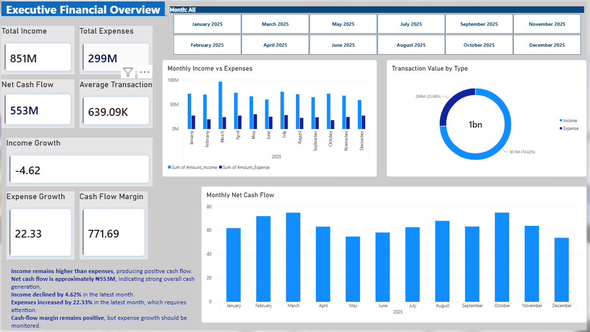
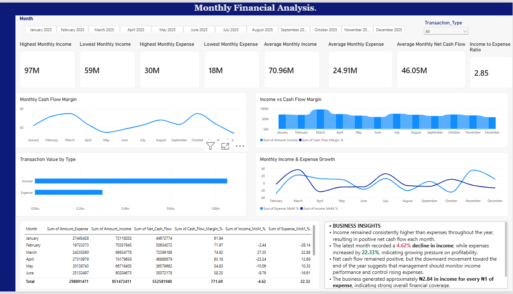
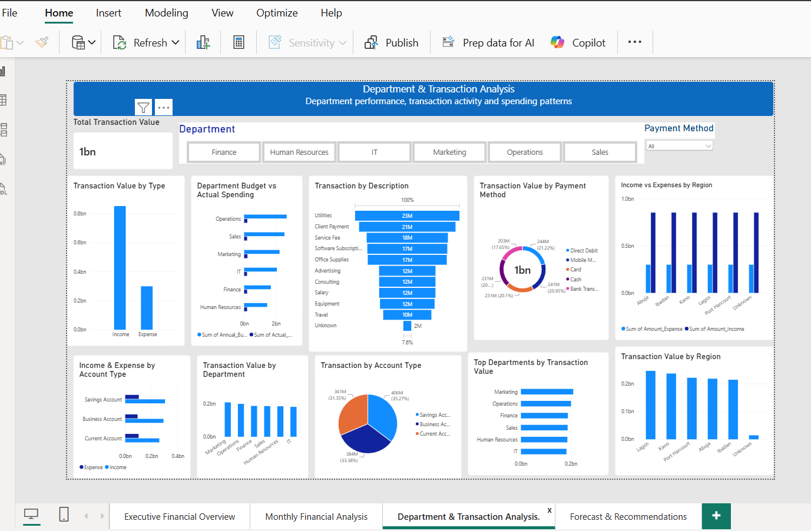

# Financial Data Automation & Analysis

## Project Overview

This project demonstrates how Python can transform raw financial transactions into useful business insights and automated financial reports.

The workflow covers data cleaning, financial analysis, automation, visualization, and Power BI reporting.

## Tools Used

* Python
* Pandas
* NumPy
* Matplotlib
* Plotly
* Jupyter Notebook
* Power BI
* Excel

## What I Did

* Cleaned and prepared financial transaction data
* Analysed income and expenses
* Calculated net cash flow
* Created monthly financial reports
* Automated financial calculations and reporting
* Built visualizations to identify trends and patterns
* Prepared analysis outputs for Power BI
* Built an interactive financial dashboard

## Key Analysis

* Monthly income and expenses
* Income vs. expenses
* Net cash flow trends
* Expense category analysis
* Department and transaction analysis
* Financial performance trends
* Forecast and recommendations

## Power BI Dashboard

### Executive Financial Overview

### Monthly Financial Analysis

### Department & Transaction Analysis

### Forecast & Recommendations

## Project Outcome

The project demonstrates how Python can be used to automate financial analysis and transform raw transaction data into structured reports and business insights.

The outputs were then used to create an interactive Power BI dashboard for financial monitoring and decision-making.
